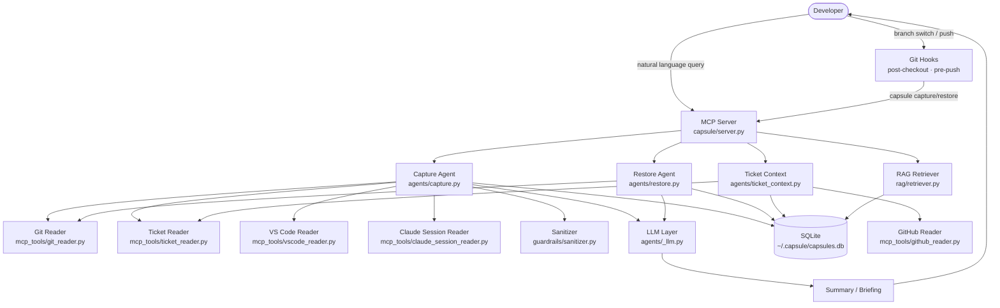

# dev-context-capsule

> Never lose your mental state mid-task again.

You're deep in a debugging session — 2 hours in, you've narrowed the bug to one function, you know exactly what to check next. Then a meeting pulls you away, or you switch branches for a hotfix. You come back the next morning and spend 30 minutes re-loading your brain.

**dev-context-capsule** fixes that. It's an MCP server that captures your dev context mid-task (what you were trying, what you found, what the next step was) and briefs you when you return — like a colleague who was watching over your shoulder.

---

## What it does

| Action | What happens |
|--------|-------------|
| `capture` | Reads your git state (branch, commits, staged/unstaged files), fetches the linked issue from the branch name (Linear or Jira), distills everything into a 3-5 sentence briefing via Claude, strips secrets, and saves to local SQLite |
| `restore` | Loads the latest capsule for your current branch, compares it against current git state, and generates a warm-up briefing: *"You were trying to fix X, you'd narrowed it to Y, next step is Z"* |
| `ticket_status` | Full context for any issue ticket: status + description, all PRs across repos (open/merged), and saved capsules — answers *"where was I on PROJ-123?"* |
| `active_tickets` | Lists all your assigned in-progress tickets (Linear or Jira) with their PR status across repos |
| `search` | TF-IDF keyword search across all your saved capsules — find past context by topic |
| `list` | See all capsules for a repo, flagged if stale (>2 weeks old) |
| Git hooks | Auto-fires capture/restore on branch switch or `git push` — zero friction |

---

## Architecture



### Data flow — Capture

```
1. Git hook fires (or you call `capture` manually)
2. GitReader snapshots: branch, last 5 commits, staged/unstaged files + diff content (2000 chars)
3. VSCodeReader reads currently open files from ~/.capsule/vscode-open-files.json
4. TicketReader fetches linked ticket from branch name (Linear or Jira) — including last 5 comments
5. ClaudeSessionReader reads recent prompts from ~/.claude/projects/ — covers VS Code, terminal, Desktop
6. Store fetches last 3 capsule summaries for this branch (session memory)
7. Sanitizer strips secrets from the combined snapshot
8. LLM sees all 6 signals → distills a 3-5 sentence capsule that continues the narrative
9. Sanitizer strips secrets from LLM output (second pass)
10. Saved to SQLite keyed by abs(repo_path) + branch
```

### Data flow — Restore

```
1. You switch to a branch / call `restore` manually
2. SQLite lookup: latest capsule for this branch
3. GitReader snapshots current state
4. LLM compares capsule vs current state → warm-up briefing
5. Briefing returned: what you were doing, what changed, first action to take
```

---

## File structure

```
dev-context-capsule/
├── capsule/
│   ├── server.py               # MCP server — defines all 9 tools
│   ├── agents/
│   │   ├── _llm.py             # LLM client factory: anthropic / bedrock / litellm — zero hardcoding
│   │   ├── capture.py          # Reads git + ticket + open files → LLM → stores capsule
│   │   ├── restore.py          # Loads capsule → LLM → warm-up briefing
│   │   └── ticket_context.py   # Aggregates ticket + PRs + capsules for a ticket ID
│   ├── mcp_tools/
│   │   ├── git_reader.py       # GitPython: branch, commits, staged/unstaged files
│   │   ├── ticket_reader.py    # Router: shared TicketInfo type + provider dispatch
│   │   ├── linear_reader.py    # Linear GraphQL provider (TICKET_PROVIDER=linear)
│   │   ├── jira_reader.py      # Jira REST API provider (TICKET_PROVIDER=jira)
│   │   ├── github_reader.py        # gh CLI: PRs across repos matching a ticket ID
│   │   ├── vscode_reader.py        # Reads ~/.capsule/vscode-open-files.json from VS Code extension
│   │   └── claude_session_reader.py# Reads ~/.claude/projects/ — recent AI conversation prompts
│   ├── memory/
│   │   └── store.py            # SQLite CRUD at ~/.capsule/capsules.db
│   ├── rag/
│   │   └── retriever.py        # TF-IDF search across all capsules
│   ├── guardrails/
│   │   └── sanitizer.py        # Secret stripping + stale detection
│   └── hooks/
│       └── install.py          # Safe hook installer — chains existing hooks, zero tracked changes
├── vscode-extension/           # Companion VS Code extension (no compilation needed)
│   ├── extension.js            # Writes open tabs to ~/.capsule/vscode-open-files.json
│   └── package.json
├── docs/
│   └── architecture.md         # Deep-dive component breakdown
├── tests/
│   ├── test_sanitizer.py
│   └── test_linear_reader.py
├── pyproject.toml
├── SPEC.md                     # Original design spec — goals, architecture, phased build plan
├── CLAUDE.md                   # Claude Code project instructions
└── README.md
```

---

## Installation

### Prerequisites

- Python 3.11+
- [`uv`](https://github.com/astral-sh/uv) (recommended) or `pip`
- An LLM API key (Anthropic, AWS Bedrock, or any OpenAI-compatible proxy)

### 1. Clone and install

```bash
git clone https://github.com/vishal-atlan/dev-context-capsule.git
cd dev-context-capsule

# with uv (recommended)
uv venv
source .venv/bin/activate
uv pip install -e ".[dev]"

# or with pip
python -m venv .venv
source .venv/bin/activate
pip install -e ".[dev]"

# if using AWS Bedrock or an OpenAI-compatible proxy, install the extra:
uv pip install -e ".[bedrock]"   # Bedrock only
uv pip install -e ".[litellm]"   # any OpenAI-compatible proxy (LiteLLM, etc.)
```

### 2. Configure your LLM provider

Pick one of the three providers below and add the env vars to your shell profile (`~/.zshrc` / `~/.bashrc`).

**Option A — Direct Anthropic API**
```bash
export ANTHROPIC_API_KEY="sk-ant-..."
```

**Option B — AWS Bedrock**
```bash
export CAPSULE_LLM_PROVIDER=bedrock
export AWS_ACCESS_KEY_ID="..."
export AWS_SECRET_ACCESS_KEY="..."
export AWS_DEFAULT_REGION="us-east-1"   # or eu-north-1, ap-southeast-2, etc.
# Model is auto-selected from your region. Override with:
# export CAPSULE_MODEL="us.anthropic.claude-sonnet-4-6"
```

**Option C — Any OpenAI-compatible proxy (LiteLLM, etc.)**
```bash
export CAPSULE_LLM_PROVIDER=litellm
export CAPSULE_LITELLM_BASE_URL="https://your-proxy.example.com"
export CAPSULE_LITELLM_API_KEY="sk-..."
# export CAPSULE_MODEL="claude-sonnet-4-6"   # optional, defaults to claude-sonnet-4-6
```

> **Passthrough mode:** If no provider is configured, `capture` and `restore` still work — they return structured markdown for Claude Code to interpret instead of calling an LLM directly. All other tools work regardless.

### 3. Verify

```bash
pytest tests/          # run tests
capsule --help         # confirm CLI is on PATH
```

---

## Configuration

### LLM provider env vars

| Variable | Description | Default |
|----------|-------------|---------|
| `CAPSULE_LLM_PROVIDER` | `anthropic` \| `bedrock` \| `litellm` | Auto-detected from `ANTHROPIC_API_KEY` |
| `CAPSULE_MODEL` | Model name/ID (any provider) | `claude-sonnet-4-6` (bedrock: derived from region) |
| `ANTHROPIC_API_KEY` | Direct Anthropic API key | — |
| `AWS_ACCESS_KEY_ID` / `AWS_SECRET_ACCESS_KEY` / `AWS_DEFAULT_REGION` | Bedrock credentials | — |
| `CAPSULE_LITELLM_BASE_URL` | Base URL of your OpenAI-compatible proxy | — |
| `CAPSULE_LITELLM_API_KEY` | API key for the proxy | — |

### Optional — Ticket integration

Set `TICKET_PROVIDER` to enable `ticket_status`, `active_tickets`, and automatic ticket enrichment at capture time.

**Linear:**

| Variable | How |
|----------|-----|
| `TICKET_PROVIDER` | `export TICKET_PROVIDER=linear` (this is the default, so optional) |
| `LINEAR_API_KEY` | `export LINEAR_API_KEY="lin_api_..."` — from `linear.app → Settings → API → Personal API keys` |

**Jira:**

| Variable | How |
|----------|-----|
| `TICKET_PROVIDER` | `export TICKET_PROVIDER=jira` |
| `JIRA_BASE_URL` | `export JIRA_BASE_URL="https://yourcompany.atlassian.net"` |
| `JIRA_EMAIL` | `export JIRA_EMAIL="you@yourcompany.com"` |
| `JIRA_API_TOKEN` | `export JIRA_API_TOKEN="..."` — from `id.atlassian.com/manage-profile/security/api-tokens` |

### Optional — GitHub PR search

Set `GITHUB_REPOS` to configure which repos are searched by `ticket_status`:

```bash
export GITHUB_REPOS="org/repo-a,org/repo-b,org/repo-c"
```

Requires the [`gh` CLI](https://cli.github.com/) to be installed and authenticated (`gh auth login`).

### Wire into Claude Code (MCP)

This is what lets you call `capture` and `restore` directly from a Claude Code conversation.

Add to `~/.claude/claude_desktop_config.json`:

```json
{
  "mcpServers": {
    "dev-context-capsule": {
      "command": "capsule",
      "args": [],
      "env": {
        "CAPSULE_LLM_PROVIDER": "litellm",
        "CAPSULE_LITELLM_BASE_URL": "https://your-proxy.example.com",
        "CAPSULE_LITELLM_API_KEY": "sk-..."
      }
    }
  }
}
```

Or for direct Anthropic:

```json
{
  "mcpServers": {
    "dev-context-capsule": {
      "command": "capsule",
      "args": [],
      "env": {
        "ANTHROPIC_API_KEY": "sk-ant-..."
      }
    }
  }
}
```

> If `capsule` isn't on your PATH, use the full path: `"/path/to/.venv/bin/capsule"`

After adding, restart Claude Code. You'll see the tools available in any conversation.

### Install git hooks into a repo

To enable auto-capture on branch switch and push for a specific repo:

```bash
python -m capsule.hooks.install /path/to/your/repo
```

This installs two hooks into the target repo's `.git/hooks/`:
- `post-checkout` — auto-restores context when you switch branches
- `pre-push` — auto-captures context before every push

### Optional — VS Code open-files integration

Install the companion extension so `capture` also records which files you have open in VS Code — the highest-signal data point for context restoration.

**1. Copy the extension into your VS Code extensions folder:**

```bash
cp -r vscode-extension ~/.vscode/extensions/capsule-open-files-0.0.1
```

> No marketplace install, no compilation — pure JavaScript.

**2. Restart VS Code.**

The extension activates on startup and writes `~/.capsule/vscode-open-files.json` on every tab change. The capsule reader picks it up automatically — it's a silent no-op if VS Code isn't open.

### Optional — set a custom storage path

By default capsules are stored at `~/.capsule/capsules.db`. To override:

```bash
export CAPSULE_DB_PATH="/your/preferred/path/capsules.db"
```

---

## Usage

### Via Claude Code (recommended)

Once wired in as an MCP server, just talk to Claude:

**Capture and restore:**
```
"Capture my context here"
→ Capsule [a1b2c3d4] saved for branch `fix/orders-n+1`.
  You were investigating an N+1 query in the orders API. You'd narrowed it
  to the eager-load on UserOrders line 84. The test in spec/orders_spec.rb
  was failing with a count mismatch. Next step was checking the includes()
  chain in the serializer.

"Restore my context"
→ CONTEXT RESTORED — branch `fix/orders-n+1`
  Welcome back. When you left, you were fixing an N+1 in the orders API,
  narrowed to line 84 of UserOrders. Since then, 2 new commits landed on
  main — none touch the orders path. Your next move: open spec/orders_spec.rb
  and run the failing test to confirm the eager-load hypothesis.
```

**Ticket-centric queries (requires ticket provider credentials):**
```
"Where was I on PROJ-123?"
→ # Context — PROJ-123

  ## Ticket
  **[PROJ-123](https://linear.app/...)** — Fix API rate-limit handling in sync job
    Status: In Progress | Assignee: You | Priority: High

  ## Pull Requests (1 total — 1 open, 0 merged, 0 closed)
  - 🟡 **[backend#47](...) — fix: retry with backoff on 429 responses
     Branch: `dev/proj-123-rate-limit` | OPEN | by you

  ## Where You Left Off (1 capsule)
  **backend** (branch: `dev/proj-123-rate-limit`)
  > Narrowed the 429s to the nightly sync job — it bursts 200 requests
  > in under a second on large datasets. Added exponential backoff in
  > sync_client.py. Next: add an integration test with a mock rate-limit server.
  _Captured: 2026-05-28 14:32_

"What are all my active tickets with PR status?"
→ # Active Tickets (3)

  ### [PROJ-123](...) — Fix API rate-limit handling in sync job
  Status: **In Progress** | Priority: High | PRs: 1 open PR

  ### [PROJ-145](...) — Add support for group filter by name
  Status: **In Progress** | Priority: Medium | PRs: no PRs | 2 capsules saved

  ### [PROJ-151](...) — Improve error messages on 403 responses
  Status: **Todo** | Priority: Medium | PRs: no PRs
```

### Via CLI

```bash
# capture current context in a repo
capsule capture /path/to/repo

# restore context for current branch
capsule restore /path/to/repo

# list all saved capsules
capsule list_saved /path/to/repo

# search across capsules
capsule search "N+1 query" /path/to/repo

# delete a capsule by ID
capsule delete a1b2c3d4
```

---

## What's not built yet

| Feature | Status | Notes |
|---------|--------|-------|
| Capsule encryption at rest | Not built | SQLite is plaintext; add SQLCipher for sensitive repos |
| Web UI / dashboard | Not built | Browse and search capsules visually |
| Team-shared capsules | Not built | Push capsules to a shared Postgres/Supabase store for handoffs |
| IDE close hook | Not built | Fire capture automatically when VS Code window closes (currently only fires on git push via hook) |

---

## Security

- Secrets are stripped **twice** — before the LLM call and before storage
- Patterns covered: JWTs, Bearer tokens, API keys, GitHub PATs, Slack tokens, AWS credentials, OpenAI/Anthropic keys
- Capsules older than 14 days are flagged `[STALE]` on list/restore
- The SQLite DB lives at `~/.capsule/capsules.db` — local only, never synced

---

## Contributing

PRs welcome. Run `ruff check capsule/` before submitting.
